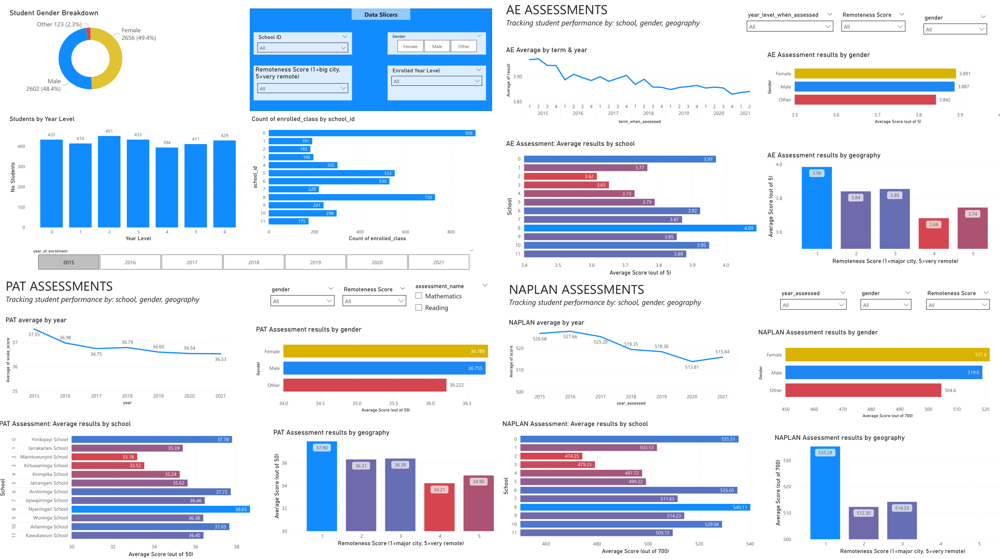

## I. Executive Summary

I developed a full analytics solution to track educational performance, from data cleaning and preparation to interactive visualisation. My platform lets administrators track student performance, identify trends, and make data-driven decisions for over 5,000 students across 11 schools over 7 years.

Screen captures of my interactive dashboards (also available as a [PDF output](02-dashboards-and-insights/performance-dashboards.pdf)):


## II. Project Workflow
```
Raw Data Sources (11 CSV files)
    ↓
Data Quality Assessment (Python/pandas)
    ↓
Data Cleaning & Transformation
    ↓
Prepared Dataset
    ↓
Power BI Dimensional Model & Dashboards
    ↓
Interactive Analysis & Insights
```

## III: Data preparation

### 3.1 Challenge
Raw data contained multiple quality issues across 11 source files:
- 25+ duplicate student records
- Inconsistent formatting (gender, year levels, class names)
- Missing values in critical fields
- Outliers in assessment scores
- Mixed data types requiring standardisation

### 3.2 Solution
Implemented systematic data cleaning and transformation process:
- **Quality validation** - Detection of duplicates, nulls, format inconsistencies
- **Data transformation** - Standardisation, imputation, outlier handling
- **Documentation** - Detailed justification for each cleaning decision

### 3.3 Transformation Examples
- Gender standardisation: 7 variations → 3 consistent categories (M, F, Other)
- Year level formatting: Mixed alphanumeric (`one`, `1`) → Integer format
- Assessment scores: Identified and handled outliers (>700 values removed)
- Class identifiers: Consolidated naming (`a`, `Class_A`) → Standard format

### 3.4 Key Deliverables
- Clean, analysis-ready dataset
- Data quality assessment documentation
- Python transformation scripts
- Validation checks

**Tools Used:** Python, pandas, NumPy, Jupyter Notebook

📁 [View Data Preparation Documentation](01-data-preparation/)

---

## IV: Business Intelligence Dashboards

### 4.1 Challenge
Stakeholders needed to analyse performance across multiple dimensions:
- Student demographics and year levels
- Schools and geographic regions
- Assessment types (NAPLAN, PAT, A&E)
- Time periods and trends

### 4.2 Solution
Designed interactive Power BI dashboards enabling:
- **Dimensional analysis** - Slicing and dicing across multiple dimensions
- **Interactive exploration** - Drill-down, cross-filtering, date navigation
- **Performance metrics** - Calculated measures for KPIs and trends
- **Visual storytelling** - Clear communication of insights to stakeholders

### 4.3 Key Features
- Performance overview with trend indicators
- Gender and demographic breakdowns
- Geographic performance comparison
- Temporal pattern analysis
- Assessment type effectiveness

**Technologies:** Power BI, DAX, Power Query

📁 [View Dashboard Documentation](02-dashboards-and-insights)

---

## V. Business Impact
### 5.1 Key Insights Generated
- **Systemic Performance Decline:** General downward trend in test scores across all assessment types over time; decline most pronounced in remote regions
- **Geographic Disparities:** Remote schools show significantly lower performance than urban counterparts; performance gap widening between geographic regions
- **Demographic Patterns:** Younger year groups in remote schools face greater performance challenges; 
- **Intervention Priorities Identified:** School #2 requires immediate targeted support across all metrics; remote region resource gaps increasingly critical. Early intervention needed for younger students in disadvantaged locations.

### 5.2 Stakeholder Value
- **Data-Driven Decision Making:** School administrators and policymakers can make decisions with measurable impact on student outcomes
- **Targeted Resource Allocation:** Dimensional analysis capabilities (slicing, dicing, drilling down) identify specific problem areas at granular level; enables early intervention programs for at-risk student demographics
- **Stakeholder Transparency & Alignment:** Dashboard promotes transparency in educational performance trends; shared understanding of priorities and challenges
- **Actionable Insights:** Specific recommendations for surveys and stakeholder interviews, with clear prioritization; remote regions, School #2, younger year groups in disadvantaged areas

## VI. Skills Demonstrated
**Data Engineering:**
- Data quality assessment and profiling
- Data cleaning and standardisation
- Python/pandas data manipulation
- Data validation methodology

**Business Intelligence:**
- Dimensional analysis design
- Dashboard development
- DAX calculations
- Stakeholder-focused visualisation

**Business Analysis:**
- Requirements interpretation
- Data-driven insight generation
- Professional documentation
- Strategic recommendations

## 7. Repository Structure
```
📁 01-data-preparation/                    - Python cleaning scripts and notebooks
📁 02-dashboards-and-insights/             - Power BI files and documentation  
```

---

*This analytics solution demonstrates capabilities developed through BSAN7205: Business Analytics Foundations at the University of Queensland (2024)*
